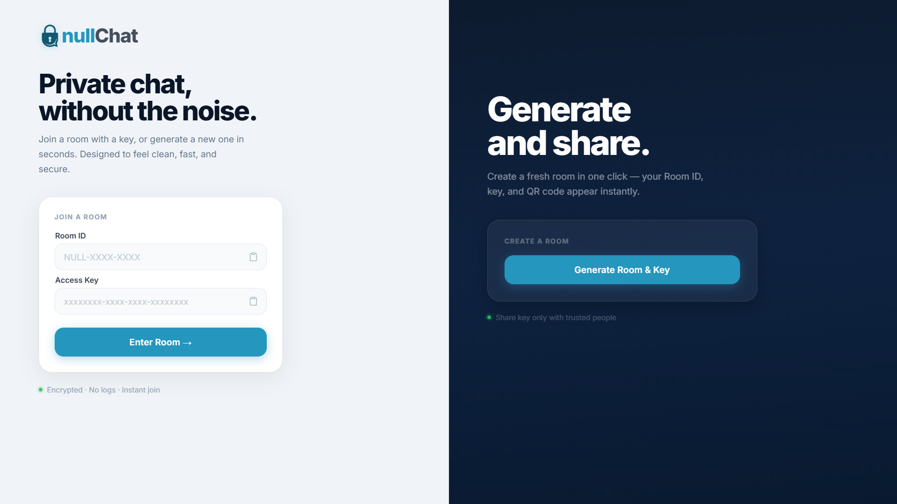
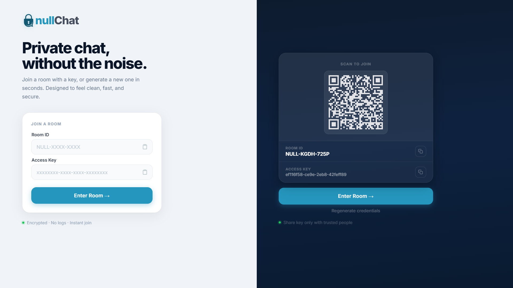
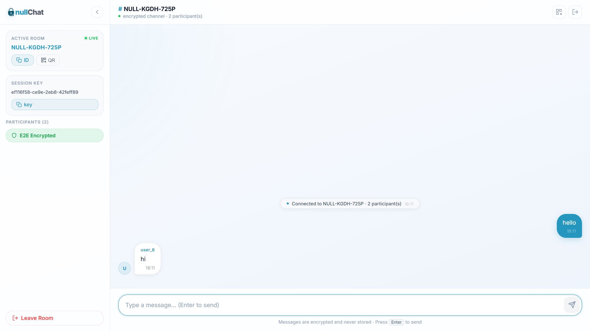

# ✨ nullChat

> Private, encrypted chat rooms. No accounts. No logs. Messages disappear.

---

## 🧠 What is nullChat?

nullChat lets you create a temporary chat room and share access with a key.
Everything is encrypted **in your browser** — the server only relays unreadable data.

No signup. No history. No trace.

---

## ⚡ Why use it?

* No accounts — just share Room ID + Key
* End-to-end encryption (AES-GCM 256-bit)
* Messages are never stored
* Rooms auto-delete after 24 hours
* Real-time chat with typing + presence
* Share access instantly via QR code

---

## 📸 Preview





---

## 🎬 Demo


---

## 🛠 Tech Stack

**Frontend**

* React 18 + Vite
* React Router
* Web Crypto API (AES-GCM, SHA-256, PBKDF2)
* CSS Modules

**Backend**

* Node.js + Fastify
* WebSockets (real-time messaging + room-based broadcasting)
* Redis (TTL-based rooms)
* JWT authentication

---

## 🔐 How it works

1. You create a room → get Room ID + Key
2. Key is never sent — only a SHA-256 hash is stored
3. Encryption key is derived client-side
4. Messages are encrypted in your browser
5. Server relays ciphertext only
6. Room auto-deletes after 24h

Server acts as a **zero-knowledge relay** — it never has access to plaintext messages or encryption keys.

---

## 🚀 Features

* [x] Encrypted real-time messaging
* [x] No accounts
* [x] Ephemeral rooms (24h)
* [x] QR code sharing
* [x] Typing indicators
* [x] Live participant count
* [ ] Rate limiting
* [ ] File + image sharing (encrypted)
* [ ] Large file sharing (up to 50GB)
* [ ] Redis Pub/Sub scaling
* [ ] Delivery receipts
* [ ] PWA support

---

## 🚀 Getting Started

### 1. Clone the repository

```bash
git clone https://github.com/dorje75/NullChat.git
cd NullChat
```

### 2. Start Redis

```bash
docker run -d --name nullchat-redis -p 6379:6379 redis:alpine
```

### 3. Install dependencies

```bash
npm install
npm run install:all
```

### 4. Run the app

```bash
npm run dev
```

---

## ⚙️ Environment

**Backend**

```env
JWT_SECRET=your-secret
REDIS_HOST=localhost
REDIS_PORT=6379
```

**Frontend**

```env
VITE_API_URL=http://localhost:3001
VITE_WS_URL=ws://localhost:3001
```

---

## 🔒 Security

* Keys never leave the browser
* Server stores only hashed keys
* Encryption key derived client-side
* Each message uses a unique IV
* Zero-knowledge relay architecture
* Stateless HTTP + stateful WebSocket architecture

